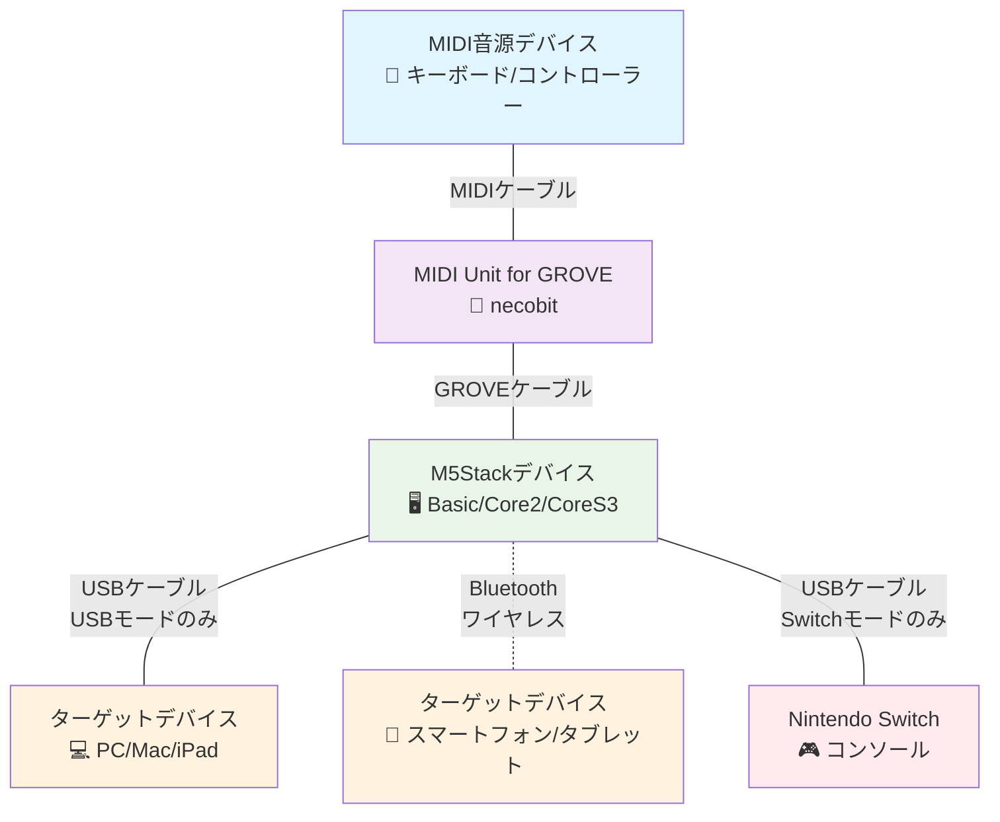

# M5 MIDI Sky - MIDI to GamePad Converter

*[English](README.md) | 日本語*

M5StackベースのMIDI to GamePadコンバーターで、MIDI音符入力をゲームパッド制御に変換します。Bluetoothゲームパッド、USBゲームパッド、Nintendo Switchコントローラー、USBキーボードなど、複数の出力モードをサポートしています。

> [!IMPORTANT]
> これは非公式のサードパーティプロジェクトであり、thatgamecompanyとは関係がなく、同社によって承認されたり、スポンサーされたりしているものではありません。このプロジェクトは、ゲームソフトウェアと相互作用したり変更したりするものではありません。これは、MIDI入力を標準的なゲームパッド/キーボード出力に変換する、一般的な用途のためのハードウェアコントローラーです。ユーザーは、適用されるすべての利用規約に準拠していることを確認する責任があります。

## 機能

- **複数のコントローラータイプ**: Bluetoothゲームパッド、USBゲームパッド、Nintendo Switch Pro Controller、USBキーボード
- **M5Stackサポート**: M5Stack Basic、Core2、CoreS3に対応
- **MIDI音符マッピング**: MIDI音符C3-C5 (48-72)をコントローラー入力にマッピング
- **設定メニューシステム**: Button Bで設定をナビゲート、Button A/Cで値を調整
- **マッピング切り替え**: 2つの異なるボタン/制御マッピング
- **トランスポーズアシスト**: 音符の範囲を半音階単位でずらし、異なるキーの楽譜を直接演奏可能

## ハードウェア要件

- M5Stackデバイス（Basic、Core2、またはCoreSS3）
- MIDI Unit for GROVE by necobit (https://necobit.booth.pm/items/5806265)
- USBモード用: M5Stack CoreS3のみ

## 接続図



### 接続詳細
- MIDI音源（キーボード、コントローラーなど）を標準MIDIケーブルでMIDI Unit for GROVEに接続
- MIDI Unit for GROVEをGROVEケーブルでM5Stackの内蔵GROVEポートに接続
- USBモード用: M5Stack CoreS3をUSBケーブルでターゲットデバイスに接続
- Bluetoothモード用: M5Stackをターゲットデバイスとワイヤレスでペアリング

## インストール

1. [PlatformIO](https://platformio.org/)をインストール
2. このリポジトリをクローン
3. `config.h.template`から`config.h`を作成
4. ターゲット環境を選択（下記のビルド環境を参照）
5. **重要**: USBモード用では、アップロード前にデバイスをダウンロードモードにする必要があります（https://docs.m5stack.com/en/core/CoreS3 を参照）
6. M5Stackデバイスにビルドしてアップロード

## ビルド環境

### Bluetooth環境
- `M5Stack-BASIC-BT-GAMEPAD` - M5Stack BasicでBluetoothゲームパッド
- `M5Stack-Core2-BT-GAMEPAD` - M5Stack Core2でBluetoothゲームパッド  
- `M5Stack-CoreS3-BT-GAMEPAD` - M5Stack CoreS3でBluetoothゲームパッド

### USB環境（CoreS3のみ）
- `M5Stack-CoreS3-USB-GAMEPAD` - M5Stack CoreS3でUSBゲームパッド
- `M5Stack-CoreS3-USB-NSWITCH` - M5Stack CoreS3でNintendo Switchコントローラー
- `M5Stack-CoreS3-USB-KEYBOARD` - M5Stack CoreS3でUSBキーボード

## ビルドとアップロード

```bash
# 特定の環境でビルド
pio run -e <環境名>

# デバイスにアップロード
pio run -t upload -e <環境名>

# シリアル出力を監視
pio device monitor

# クリーンビルド
pio run -t clean

# 例: M5Stack CoreS3 USBゲームパッド用にビルドしてアップロード
pio run -t upload -e M5Stack-CoreS3-USB-GAMEPAD
```

## 使用方法

### 基本操作

1. **ハードウェアセットアップ**: MIDI Unit for GROVEをM5Stackの内蔵GROVEポートに接続
2. **電源オン**: M5Stackが視覚的なキーボードインターフェースを表示
3. **MIDI入力**: MIDI音源を適切なGPIOピンに接続:
   - M5Stack Basic: RX=22, TX=21
   - M5Stack Core2: RX=33, TX=32  
   - M5Stack CoreS3: RX=1, TX=2
4. **コントローラー出力**: 
   - Bluetoothモード: ターゲットデバイスとペアリング
   - USBモード: M5Stack CoreS3をUSBケーブルで接続

### コントロール

- **Button A**: 現在の設定値を減少（設定が選択されている時）
- **Button B**: 設定項目を循環（なし → マッピング → 移調 → なし...）
- **Button C**: 現在の設定値を増加（設定が選択されている時）

#### 設定メニュー
- **なし**: 初期状態 - A/Cボタンは無効、Bボタンを押して設定を選択
- **マッピング**: A/Cボタンでマッピングモード（1-2）を切り替え
- **移調**: A/Cボタンで移調値（-12から+12半音）を調整

### MIDI音符マッピング

システムは15の特定のMIDI音符をコントローラー入力にマッピングします:
- **音符範囲**: C3からC5（MIDI音符48, 50, 52, 53, 55, 57, 59, 60, 62, 64, 65, 67, 69, 71, 72）
- **マッピング**: 各コントローラータイプには、これら15の位置を特定の出力に変換する独自のマッピングテーブルがあります
- **移調**: Button A/Cを使用して、全体の範囲を半音階単位で上下にシフト（移調設定が選択されている時）

## コントローラー互換性

### Bluetoothゲームパッド
- Xbox One Sコントローラーをエミュレート
- **テスト済みデバイス**: macOS 15: Apple MacBook Pro (M1)、Windows 11: Microsoft Surface Pro 7、iOS 18: Apple iPad (10th gen.)
- **動作しない**: Android 16: Google Pixel 7a

### USBゲームパッド
- Logitech F310コントローラーをエミュレート
- **テスト済みデバイス**: macOS 15: Apple MacBook Pro (M1)、Windows 11: Microsoft Surface Pro 7、iOS 18: Apple iPad (10th gen.)
- **動作しない**: Android 16: Google Pixel 7a

### USBキーボード
- Logitech Unifyingキーボードをエミュレート
- **テスト済みデバイス**: macOS 15: Apple MacBook Pro (M1)、Windows 11: Microsoft Surface Pro 7、Android 16: Google Pixel 7a
- **動作しない**: iOS 18: Apple iPad (10th gen.)

### Nintendo Switchコントローラー
- Nintendo Switch Pro Controllerをエミュレート
- **テスト済みデバイス**: Nintendo Switch: HAC-001

### 互換性まとめ

| デバイス | Bluetoothゲームパッド | USBゲームパッド | USBキーボード |
|--------|------------------|-------------|--------------|
| Windows 11: Microsoft Surface Pro 7 | ✅ | ✅ | ✅ |
| macOS 15: Apple MacBook Pro (M1) | ✅ | ✅ | ✅ |
| iOS 18: Apple iPad (10th gen.) | ✅ | ✅ | ❌ |
| Android 16: Google Pixel 7a | ❌ | ❌ | ✅ |

> [!NOTE]
> 追加のデバイスとプラットフォームでの互換性を改善するコード貢献を歓迎します！

## 謝辞

このプロジェクトは、おにぎり([@onigiri-uma2](https://github.com/onigiri-uma2))さんによる以下の作品にインスパイアされ、参考にさせていただきました:
- [Midi2XInput](https://github.com/onigiri-uma2/Midi2XInput)
- [Midi2Switch](https://github.com/onigiri-uma2/Midi2Switch)

このプロジェクトを可能にするのに役立った貴重な洞察と実装に感謝します！

## 商標

以下の商標および登録商標は、それぞれの所有者の財産です:
- M5Stack®は、M5Stack Technology Co., Ltd.の商標です。
- Nintendo Switch®は、任天堂株式会社の商標です。
- Xbox®は、Microsoft Corporationの商標です
- Logitech®は、Logitech International S.A.の商標です。
- PlatformIO®は、PlatformIO Labsの商標です
- Apple®、macOS®、iOS®、およびiPad®は、Apple Inc.の商標です。
- Microsoft®およびWindows®は、Microsoft Corporationの商標です
- Android®およびGoogle Pixel®は、Google LLCの商標です

このプロジェクトは、上記に記載された商標所有者のいずれとも関係がなく、承認されていません。

## ライセンス

このプロジェクトはオープンソースです。詳細はライセンスファイルをご覧ください。