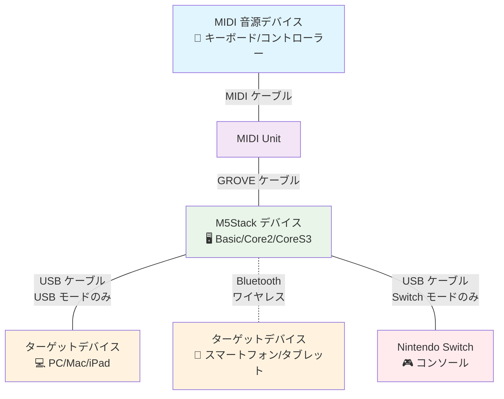

# M5 MIDI Sky - MIDI to GamePad Converter

*[English](README.md) | 日本語*

M5Stack ベースの MIDI to GamePad コンバーターで、MIDI 音符入力をゲームパッド制御に変換します。Bluetooth ゲームパッド、USB ゲームパッド、Nintendo Switch コントローラー、USB キーボードなど、複数の出力モードをサポートしています。

> [!IMPORTANT]
> これは非公式のサードパーティプロジェクトであり、thatgamecompany とは関係がなく、同社によって承認されたり、スポンサーされたりしているものではありません。このプロジェクトは、ゲームソフトウェアと相互作用したり変更したりするものではありません。これは、MIDI 入力を標準的なゲームパッド/キーボード出力に変換する、一般的な用途のためのハードウェアコントローラーです。ユーザーは、適用されるすべての利用規約に準拠していることを確認する責任があります。

## 機能

- **複数のコントローラータイプ**: Bluetooth ゲームパッド, USB ゲームパッド, Nintendo Switch Pro Controller, USB キーボード
- **M5Stack サポート**: M5Stack Basic, Core2, CoreS3 に対応
- **MIDI 音符マッピング**: MIDI 音符をコントローラー入力にマッピング
- **設定メニューシステム**: Button B で設定をナビゲート、Button A/C で値を調整
- **マッピング切り替え**: 複数の異なるボタン/制御マッピング
- **基準音設定 (トランスポーズアシスト)**: MIDI 入力の基準音を設定でき、異なるキーの楽譜を直接演奏可能
- **拡張モード**: 範囲外の鍵盤も演奏可能な範囲にフォールディング

## ハードウェア要件

- M5Stack デバイス (Basic、Core2、または CoreSS3)
- Unit MIDI (https://docs.m5stack.com/en/unit/Unit-MIDI)
  - または MIDI Unit for GROVE by necobit (https://necobit.booth.pm/items/5806265)
- USB モード用: M5Stack CoreS3 のみ

## 接続図


```mermaid
graph TD
    A[MIDI 音源デバイス<br/>🎹 キーボード/コントローラー]
    B[MIDI Unit]
    C[M5Stack デバイス<br/>🖥️ Basic/Core2/CoreS3]
    D1[ターゲットデバイス<br/>💻 PC/Mac/iPad]
    D2[ターゲットデバイス<br/>📱 スマートフォン/タブレット]
    D3[Nintendo Switch<br/>🎮 コンソール]

    A ---|MIDI ケーブル| B
    B ---|GROVE ケーブル| C
    C ---|USB ケーブル<br/>USB モードのみ| D1
    C -.-|Bluetooth<br/>ワイヤレス| D2
    C ---|USB ケーブル<br/>Switch モードのみ| D3

    style A fill:#e1f5fe
    style B fill:#f3e5f5
    style C fill:#e8f5e8
    style D1 fill:#fff3e0
    style D2 fill:#fff3e0
    style D3 fill:#ffebee
```

### 接続詳細

- MIDI 音源 (キーボード、コントローラーなど) を標準 MIDI ケーブルで MIDI Unit に接続
- MIDI Unit を GROVE ケーブルで M5Stack の内蔵 GROVE ポートに接続
- USB モード用: M5Stack デバイスを USB ケーブルでターゲットデバイスに接続
- Bluetooth モード用: M5Stack をターゲットデバイスとワイヤレスでペアリング

## インストール

1. [PlatformIO](https://platformio.org/) をインストール
2. このリポジトリをクローン
3. `config.h.template` から `config.h` を作成
4. ターゲット環境を選択 (下記のビルド環境を参照)
5. **重要**: USB モード用では、アップロード前に M5Stack デバイスをダウンロードモードにする必要があります (https://docs.m5stack.com/en/core/CoreS3 を参照)
6. M5Stack デバイスにビルドしてアップロード

## ビルド環境

### Bluetooth 環境

- `M5Stack-BASIC-BT-GAMEPAD` - M5Stack Basic で Bluetooth ゲームパッド
- `M5Stack-Core2-BT-GAMEPAD` - M5Stack Core2 で Bluetooth ゲームパッド
- `M5Stack-CoreS3-BT-GAMEPAD` - M5Stack CoreS3 で Bluetooth ゲームパッド

### USB 環境 (CoreS3 のみ)

- `M5Stack-CoreS3-USB-GAMEPAD` - M5Stack CoreS3 で USB ゲームパッド
- `M5Stack-CoreS3-USB-NSWITCH` - M5Stack CoreS3 で Nintendo Switch コントローラー
- `M5Stack-CoreS3-USB-KEYBOARD` - M5Stack CoreS3 で USB キーボード

## ビルドとアップロード

```bash
# 特定の環境でビルド
pio run -e <環境名>

# デバイスにアップロード
pio run -t upload -e <環境名>

# シリアル出力を監視
pio device monitor

# クリーンビルド
pio run -t clean

# 例: M5Stack CoreS3 USB ゲームパッド用にビルドしてアップロード
pio run -t upload -e M5Stack-CoreS3-USB-GAMEPAD
```

## 使用方法

### 基本操作

1. **ハードウェアセットアップ**: MIDI Unit を M5Stack の GROVE PORT.A 接続
   - M5Stack Basic: RX=22, TX=21
   - M5Stack Core2: RX=33, TX=32
   - M5Stack CoreS3: RX=1, TX=2
2. **電源オン**
3. **コントローラー接続**:
   - Bluetooth モード: ターゲットデバイスとペアリング
   - USB モード: M5Stack を USB ケーブルでターゲットデバイスと接続

### コントロール

- **Button A**: 現在の設定値を減少 (設定が選択されている時)
- **Button B**: 設定項目を切り替え (None → Mapping → Base Note → Expand → None...)
- **Button C**: 現在の設定値を増加 (設定が選択されている時)

#### 設定メニュー

- 初期状態 - A/C ボタンは無効、B ボタンを押して設定を選択
- **Mapping**: A/C ボタンでマッピングモード (1-2) を切り替え
- **Base note**: 基準音を設定 - A/C ボタンで半音単位で設定
- **Expand**: A/C ボタンで拡張モード (ON/OFF) を切り替え - ON の場合、範囲外の鍵盤も演奏可能な範囲にフォールディング

### MIDI 音符マッピング

システムは 15 の特定の MIDI 音符をコントローラー入力にマッピングします:

- **音符範囲**: 標準は C3 から C5 (48, 50, 52, 53, 55, 57, 59, 60, 62, 64, 65, 67, 69, 71, 72)
- **マッピング**: 各コントローラータイプには、これら 15 の位置を特定の出力に変換する独自のマッピングテーブルがあります
- **基準音**: 基準音を設定して鍵盤の範囲をシフト
- **拡張モード**: ON の場合、範囲外の鍵盤も演奏可能な範囲にフォールディング

## コントローラー互換性

### Bluetooth ゲームパッド

- Xbox One S コントローラーをエミュレート
- **テスト済みデバイス**: macOS 15: Apple MacBook Pro (M1), Windows 11: Microsoft Surface Pro 7, iOS 18: Apple iPad (10th gen.)
- **動作しない**: Android 16: Google Pixel 7a

### USB ゲームパッド

- Logitech F310 コントローラーをエミュレート
- **テスト済みデバイス**: macOS 15: Apple MacBook Pro (M1), Windows 11: Microsoft Surface Pro 7, iOS 18: Apple iPad (10th gen.)
- **動作しない**: Android 16: Google Pixel 7a

### USB キーボード

- **テスト済みデバイス**: macOS 15: Apple MacBook Pro (M1), Windows 11: Microsoft Surface Pro 7, Android 16: Google Pixel 7a
- **動作しない**: iOS 18: Apple iPad (10th gen.)

### Nintendo Switch コントローラー

- Nintendo Switch Pro Controller をエミュレート
- **テスト済みデバイス**: Nintendo Switch: HAC-001

### 互換性まとめ

| デバイス | Bluetooth ゲームパッド | USB ゲームパッド | USB キーボード |
|--------|------------------|-------------|--------------|
| Windows 11: Microsoft Surface Pro 7 | ✅ | ✅ | ✅ |
| macOS 15: Apple MacBook Pro (M1) | ✅ | ✅ | ✅ |
| iOS 18: Apple iPad (10th gen.) | ✅ | ✅ | ❌ |
| Android 16: Google Pixel 7a | ❌ | ❌ | ✅ |

## 謝辞

このプロジェクトは、おにぎり ([@onigiri-uma2](https://github.com/onigiri-uma2)) さんによる以下の作品にインスパイアされ、参考にさせていただきました:

- [Midi2XInput](https://github.com/onigiri-uma2/Midi2XInput)
- [Midi2Switch](https://github.com/onigiri-uma2/Midi2Switch)

このプロジェクトを可能にするのに役立った貴重な洞察と実装に感謝します！

## 商標

以下の商標および登録商標は、それぞれの所有者の財産です:

- M5Stack® は、M5Stack Technology Co., Ltd. の商標です。
- Nintendo Switch® は、任天堂株式会社の商標です。
- Xbox® は、Microsoft Corporation の商標です
- Logitech® は、Logitech International S.A. の商標です。
- PlatformIO® は、PlatformIO Labs の商標です
- Apple®、macOS®、iOS®、および iPad® は、Apple Inc. の商標です。
- Microsoft® および Windows® は、Microsoft Corporation の商標です
- Android® および Google Pixel® は、Google LLC の商標です

このプロジェクトは、上記に記載された商標所有者のいずれとも関係がなく、承認されていません。

## ライセンス

このプロジェクトはオープンソースです。詳細はライセンスファイルをご覧ください。
