# M5 MIDI Sky - MIDI to GamePad Converter

*English | [日本語](README.ja.md)*

M5Stack-based MIDI to GamePad converter that translates MIDI note inputs into gamepad controls. Supports multiple output modes including Bluetooth gamepads, USB gamepads, Nintendo Switch controllers, and USB keyboards.

> [!IMPORTANT]
> This is an unofficial third-party project and is not affiliated with, endorsed by, or sponsored by thatgamecompany. This project does not interact with or modify any game software. It is a hardware controller that converts MIDI input to standard gamepad/keyboard output for general use. Users are responsible for ensuring their use complies with all applicable terms of service.

## Features

- **Multiple Controller Types**: Bluetooth gamepad, USB gamepad, Nintendo Switch Pro Controller, USB keyboard
- **M5Stack Support**: Compatible with M5Stack Basic, Core2, and CoreS3
- **MIDI Note Mapping**: Maps MIDI notes C3-C5 (48-72) to controller inputs
- **Dual Mapping System**: Two different button/control mappings switchable via M5Stack Button B
- **Transpose Assist**: Shift note range up/down by semitones using Button A/C, allowing you to play sheet music in different keys directly

## Hardware Requirements

- M5Stack device (Basic, Core2, or CoreS3)
- MIDI Unit for GROVE by necobit (https://necobit.booth.pm/items/5806265)
- For USB modes: M5Stack CoreS3 only

## Connection Diagram

```mermaid
graph TD
    A[MIDI Source Device<br/>🎹 Keyboard/Controller] 
    B[MIDI Unit for GROVE<br/>📡 necobit]
    C[M5Stack Device<br/>🖥️ Basic/Core2/CoreS3]
    D1[Target Device<br/>💻 PC/Mac/iPad]
    D2[Target Device<br/>📱 Smartphone/Tablet]
    D3[Nintendo Switch<br/>🎮 Console]
    
    A ---|MIDI Cable| B
    B ---|GROVE Cable| C
    C ---|USB Cable<br/>USB modes only| D1
    C -.-|Bluetooth<br/>Wireless| D2
    C ---|USB Cable<br/>Switch mode only| D3
    
    style A fill:#e1f5fe
    style B fill:#f3e5f5
    style C fill:#e8f5e8
    style D1 fill:#fff3e0
    style D2 fill:#fff3e0
    style D3 fill:#ffebee
```



### Connection Details
- Connect MIDI source (keyboard, controller, etc.) to MIDI Unit for GROVE via standard MIDI cable
- Connect MIDI Unit for GROVE to M5Stack's built-in GROVE port using GROVE cable
- For USB modes: Connect M5Stack CoreS3 to target device via USB cable
- For Bluetooth modes: Pair M5Stack with target device wirelessly

## Installation

1. Install [PlatformIO](https://platformio.org/)
2. Clone this repository
3. Create `config.h` from `config.h.template`
4. Choose your target environment (see Build Environments below)
5. **Important**: For USB modes, ensure the device is in Download Mode before uploading (see https://docs.m5stack.com/en/core/CoreS3)
6. Build and upload to your M5Stack device

## Build Environments

### Bluetooth Environments
- `M5Stack-BASIC-BT-GAMEPAD` - M5Stack Basic with Bluetooth gamepad
- `M5Stack-Core2-BT-GAMEPAD` - M5Stack Core2 with Bluetooth gamepad  
- `M5Stack-CoreS3-BT-GAMEPAD` - M5Stack CoreS3 with Bluetooth gamepad

### USB Environments (CoreS3 only)
- `M5Stack-CoreS3-USB-GAMEPAD` - M5Stack CoreS3 with USB gamepad
- `M5Stack-CoreS3-USB-NSWITCH` - M5Stack CoreS3 with Nintendo Switch controller
- `M5Stack-CoreS3-USB-KEYBOARD` - M5Stack CoreS3 with USB keyboard

## Building and Uploading

```bash
# Build for specific environment
pio run -e <environment_name>

# Upload to device
pio run -t upload -e <environment_name>

# Monitor serial output
pio device monitor

# Clean build
pio run -t clean

# Example: Build and upload for M5Stack CoreS3 USB gamepad
pio run -t upload -e M5Stack-CoreS3-USB-GAMEPAD
```

## Usage

### Basic Operation

1. **Hardware Setup**: Connect MIDI Unit for GROVE to M5Stack's built-in GROVE port
2. **Power On**: The M5Stack will display a visual keyboard interface
3. **MIDI Input**: Connect MIDI source to the appropriate GPIO pins:
   - M5Stack Basic: RX=22, TX=21
   - M5Stack Core2: RX=33, TX=32  
   - M5Stack CoreS3: RX=1, TX=2
4. **Controller Output**: 
   - Bluetooth modes: Pair with target device
   - USB modes: Connect M5Stack CoreS3 via USB cable

### Controls

- **Button A**: Transpose down (lower pitch)
- **Button B**: Switch between mapping modes (2 different control schemes)
- **Button C**: Transpose up (higher pitch)

### MIDI Note Mapping

The system maps 15 specific MIDI notes to controller inputs:
- **Note Range**: C3 to C5 (MIDI notes 48, 50, 52, 53, 55, 57, 59, 60, 62, 64, 65, 67, 69, 71, 72)
- **Mapping**: Each controller type has its own mapping table that converts these 15 positions to specific outputs
- **Transpose**: Use Button A/C to shift the entire range up/down by semitones


## Controller Compatibility

### Bluetooth Gamepad
- Emulates Xbox One S controller
- **Tested devices**: macOS 15: Apple MacBook Pro (M1), Windows 11: Microsoft Surface Pro 7, iOS 18: Apple iPad (10th gen.)
- **Not working**: Android 16: Google Pixel 7a

### USB Gamepad
- Emulates Logitech F310 controller
- **Tested devices**: macOS 15: Apple MacBook Pro (M1), Windows 11: Microsoft Surface Pro 7, iOS 18: Apple iPad (10th gen.)
- **Not working**: Android 16: Google Pixel 7a

### USB Keyboard
- Emulates Logitech Unifying keyboard
- **Tested devices**: macOS 15: Apple MacBook Pro (M1), Windows 11: Microsoft Surface Pro 7, Android 16: Google Pixel 7a
- **Not working**: iOS 18: Apple iPad (10th gen.)

### Nintendo Switch Controller
- Emulates Nintendo Switch Pro Controller
- **Tested devices**: Nintendo Switch: HAC-001

### Compatibility Summary

| Device | Bluetooth Gamepad | USB Gamepad | USB Keyboard |
|--------|------------------|-------------|--------------|
| Windows 11: Microsoft Surface Pro 7 | ✅ | ✅ | ✅ |
| macOS 15: Apple MacBook Pro (M1) | ✅ | ✅ | ✅ |
| iOS 18: Apple iPad (10th gen.) | ✅ | ✅ | ❌ |
| Android 16: Google Pixel 7a | ❌ | ❌ | ✅ |

> [!NOTE]
> Code contributions to improve compatibility with additional devices and platforms are welcome!


## Acknowledgments

This project was inspired by and references the following works by おにぎり ([@onigiri-uma2](https://github.com/onigiri-uma2)):
- [Midi2XInput](https://github.com/onigiri-uma2/Midi2XInput)
- [Midi2Switch](https://github.com/onigiri-uma2/Midi2Switch)

Special thanks for the valuable insights and implementations that helped make this project possible.

## Trademarks

The following trademarks and registered trademarks are the property of their respective owners:
- M5Stack® is a trademark of M5Stack Technology Co., Ltd.
- Nintendo Switch® is a trademark of Nintendo Co., Ltd.
- Xbox® is a trademark of Microsoft Corporation
- Logitech® is a trademark of Logitech International S.A.
- PlatformIO® is a trademark of PlatformIO Labs
- Apple®, macOS®, iOS®, and iPad® are trademarks of Apple Inc.
- Microsoft® and Windows® are trademarks of Microsoft Corporation
- Android® and Google Pixel® are trademarks of Google LLC

This project is not affiliated with or endorsed by any of the trademark owners mentioned above.

## License

This project is open source. See the license file for details.
